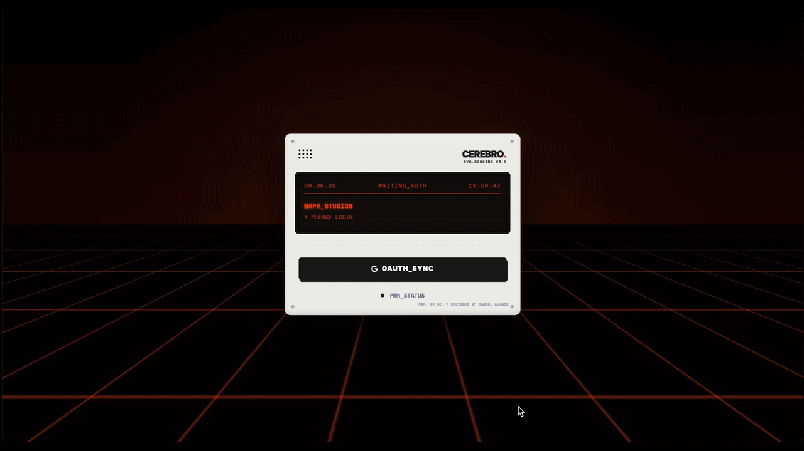

# 🎛️ CEREBRO — SYS.BOOKING v3.0

**Serverless Enterprise-Grade Web Application for High-Performance Recording Studio Management**


*Interfaz principal de Cerebro en funcionamiento.*

## 📝 Resumen Ejecutivo

Cerebro (SYS.BOOKING v3.0) es una solución de software web B2B de arquitectura serverless y alto rendimiento, diseñada para centralizar y automatizar el flujo de trabajo de reservas de salas y controles de grabación en entornos de producción musical complejos.

El sistema elimina por completo la necesidad de servidores dedicados y bases de datos relacionales costosas de mantener, aprovechando la infraestructura de Google Workspace como un Backend-as-a-Service (BaaS). A través de un puente asíncrono optimizado con Google Apps Script (GAS), Cerebro ofrece sincronización bidireccional en tiempo real, validación algorítmica de conflictos de calendario, reglas de negocio dinámicas por sello discográfico y un sistema automatizado de aprobaciones fuera de jornada con alertas directas mediante integraciones coordinadas de correo electrónico y mensajería instantánea (WhatsApp).

## 🧠 Características Principales (Key Features)

### 🔐 1. Control de Acceso y Gestión de Identidad (OAuth 2.0)

* **Google Identity Services (GSI) Integration:** Autenticación federada utilizando el estándar de la industria OAuth 2.0.
* **Filtro Dinámico de Dominios:** Restricción de acceso en tiempo real a nivel de frontend y backend para correos electrónicos que pertenezcan exclusivamente a dominios corporativos preaprobados.
* **Permisos Granulares por Token:** Solicitud explícita del scope `calendar.readonly` para que los gestores de proyectos (PMs) puedan leer el estado del calendario corporativo desde el navegador.

### ⚡ 2. Motor de Resolución de Conflictos en Tiempo Real

* **Estrategia de Optimización de Consultas:** El frontend realiza peticiones directas y optimizadas a la API de Calendar limitando la búsqueda mediante parámetros de tiempo estrictos (`timeMin` y `timeMax`).
* **Prevención de Doble Reserva:** En caso de solapamiento de horario en el espacio solicitado, el sistema bloquea la transacción de inmediato, notificando visualmente al operador en la consola del sistema.

### 💬 3. Notificaciones Instantáneas y Alertas vía WhatsApp (CallMeBot API)

* **Notificación de Excepciones en Tiempo Real:** El backend no depende únicamente de la bandeja de entrada de correo; ante una solicitud de horario especial o fuera de jornada, el sistema dispara un webhook asíncrono.
* **Pasarela CallMeBot:** Integra un cliente HTTP en Google Apps Script que emite una petición HTTPS estructurada hacia el API Gateway de CallMeBot, entregando un mensaje en formato Markdown directamente al dispositivo móvil del Studio Manager.
* **Enlaces de Acción Inmediata:** El mensaje push de WhatsApp encapsula los metadatos de la sesión (Artista, Sala, Horario solicitado) y el enlace directo cifrado con el token UUID para que el administrador pueda auditar y resolver la solicitud en un solo clic.

### 📊 4. Motor de Cuotas Dinámicas por Sello (Business Logic)

* **Control de Concurrencia Diario:** Lógica de negocio avanzada parametrizada para auditar cuántos estudios distintos tiene reservados de forma concurrente una misma discográfica en un mismo día.
* **Límites de Uso Asimétricos:** Configuración asimétrica de cuotas rígidas dependiendo de la empresa de management o sello discográfico asociado.

### 🎚️ 5. UI/UX Skeuomórfica de Alto Rendimiento

* **Diseño Brutalista Industrial:** Interfaz inspirada en el hardware de diseño musical de *Teenage Engineering* (botones Chunky, etiquetas de esquema electrónico de precisión y un chasis metálico virtual con tornillería).
* **Aceleración por GPU:** Fondo de rejilla 3D Synthwave/Outrun fluida y optimizada mediante transformaciones CSS3 tridimensionales (`transform: translateY`), forzando el renderizado a 60 FPS.

## 🔄 Arquitectura y Flujo de Usuario (User Flow)

```text
[ Usuario ] ──► [ OAuth 2.0 ] ──► [ Filtro Dominio ] ──► [ Render de Formulario ]
                                                                 │
[ Solicitud Normal ] ◄── [ Validador de Reglas de Negocio (GAS) ] ◄─┘
         │
         ├─── (Consistencia de Horario L-V: 10h-22h) ──► [ Reserva Directa ]
         │
         └─── (Horas Extra / Fines de Semana) ─────────► [ Transición a Excepción ]
                                                                 │
                                                   [ ScriptProperties (UUID) ]
                                                                 │
                                                    ┌────────────┴────────────┐
                                                    ▼                         ▼
                                            [ Alerta Email ]         [ Alerta WhatsApp ]
                                                    │                   (CallMeBot API)
                                                    └────────────┬────────────┘
                                                                 ▼
                                                       [ approval.html ]
                                                                 │
                                                       (Aprobar / Denegar)
                                                                 │
                                                    [ Escritura / Refracción ]
🛠️ Stack Tecnológico
FRONTEND CLIENT (SPA)

HTML5 + CSS Custom Properties (Teenage Engineering UI)

Tailwind CSS (Utility-First Layouts) & FontAwesome Icons

Vanilla JavaScript (ES6+ Asynchronous Fetch & Event Listeners)

Google Identity Services SDK

SERVERLESS BACKEND ENGINE

Google Apps Script (GAS) como API Web App (doPost / doGet Router).

Google Calendar API (Base de datos principal temporal).

GmailApp API (Sistema de notificaciones por correo electrónico).

CallMeBot API Gateway: Pasarela externa encargada de transformar las solicitudes HTTPS del middleware en mensajes push nativos dentro de WhatsApp.

📦 Instrucciones de Despliegue (Setup)
Nota: Asegúrese de modificar los valores ficticios por los IDs reales de su organización.

Paso 1: Configurar el Script en Google Apps Script
Crea un nuevo proyecto en GAS, asigna el nombre Cerebro_Backend y pega el contenido de backend_script.js (renombrado a .gs).

Configura las variables globales obligatorias de la infraestructura de Google:

JavaScript
var PORTAL_URL = '[https://tudominio.com/index.html](https://tudominio.com/index.html)'; // Dirección final de producción
var CALENDAR_ID = 'tu_calendario_booking@tuempresa.com'; // ID de Google Calendar
var MAIN_STUDIO_EMAIL = 'admin@tuempresa.com'; // Correo de administración
Paso 2: Configuración del Bot de WhatsApp (CallMeBot Integration)
Para activar las alertas automatizadas en el teléfono del administrador:

Agrega el número de teléfono oficial del bot de CallMeBot a tus contactos de WhatsApp (puedes solicitar el número actualizado en callmebot.com).

Envía un mensaje de texto por WhatsApp al bot con la siguiente cadena exacta: I allow callmebot to send me messages.

El bot validará tu sesión y te responderá automáticamente con tu API Key personalizada.

En tu archivo de backend backend_script.gs, localiza y rellena las variables de configuración de WhatsApp con tu número (incluyendo el prefijo internacional del país, ej. 34 para España) y la clave recibida:

JavaScript
var WHATSAPP_PHONE = '34XXXXXXXXX'; // Tu número de teléfono destino
var WHATSAPP_APIKEY = 'XXXXXX';      // La API Key asignada por el bot
El motor de GAS procesará de forma interna una llamada UrlFetchApp.fetch() utilizando codificación URI (encodeURIComponent) para formatear los saltos de línea y las negritas antes de enviarlo a la pasarela.

Paso 3: Crear el Consentimiento en Google Cloud
Crea un proyecto en GCP, configura la pantalla de consentimiento OAuth 2.0 en modo interno (o externo para pruebas).

Genera un Client ID para aplicaciones web y añade el dominio de tu servidor en "Orígenes de JavaScript autorizados".

Paso 4: Publicar la API e Interconectar Frontend
Implementa el script en GAS como "Aplicación Web", ejecutable como "Mi cuenta" y con acceso configurado para "Cualquier persona" (para saltar restricciones CORS). Copia la URL generada terminada en /exec.

Abre tu entorno local e instala tu GOOGLE_CLIENT_ID y tu GAS_WEBAPP_URL en los archivos script.js, modificar.js y approval.js.

Sube la carpeta estática sanitizada a tu proveedor de hosting (GitHub Pages, Vercel o Hostinger).

🔒 Licencia
Este proyecto es software privado y está distribuido bajo la licencia MIT de código abierto para fines demostrativos y de portfolio.